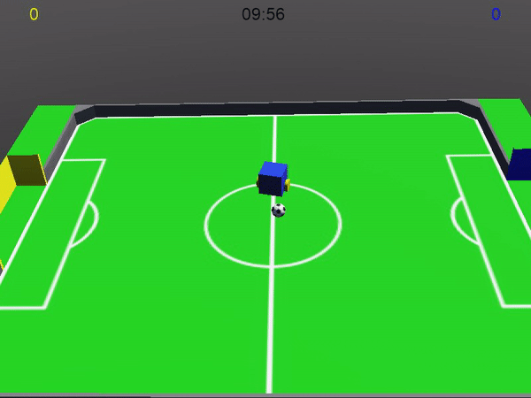

# v4s webots
Projeto Very Small Size Soccer Simulation (V4S) pelo Webots, utilizando comunicação tcp/ip.

## Sobre

Base de uma simulação de um time de Very Small Size Soccer feita no webots. Os robôs receberão os comandos através de protocolo tcp/ip e o simulador irá rodar a partida. 

A ideia é poder simular de forma realista e personalizável o time de Very Small Size Soccer da ERUS, mas pode ser modificada para simular outros robôs de Very Small Size Soccer.

## Webots PROTOs
De acordo com o [manual de referência do Webots](https://www.cyberbotics.com/doc/reference/proto-definition): 

    "A PROTO node is defined in a PROTO file. A PROTO file ends with a .proto extension. It lists the fields of the PROTO and defines how these fields impact the underlying object which is defined using base nodes and/or PROTO nodes."

Neste projeto estão definidos quatro PROTOs. Neles, temos alguns campos que podem ser modificados:

### v4s_soccer_field

- fieldName : String 
O nome do objeto v4s_soccer_field
- fieldTexture : [url] 
url da textura do campo

### soccer_referee_supervisor

- supervisorRange : float
- supervisorBaudRate : int
- robotController : String

### Ball
- translation : float[3] 
Posição do objeto na simulação
- rotation : rotation 
Rotação do objeto na simulação
- radius : float 
Raio da bola
- mass : float 
Massa do objeto

### V4SRobot

- translation : float[3] 
Posição do objeto na simulação
- rotation : rotation 
Rotação do objeto na simulação
- bodyMass : float 
Massa do corpo do robô
- wheelsMass : float 
Massa de cada roda
- robotController : String 
Controlador (código) do robô
- robotName : String 
Nome do robô
- robotAppearance : Appearance 
Aparência do robô
- wheelsAppearance : Appearance 
Aparência de cada roda
- synchronization : Boolean 

## Dados da Equipe:
O VSSS-ERUS é uma equipe dedicada a implementação do desafio Very Small Size Soccer para competições. É um projeto da ERUS - Equipe de Robótica da UFES, e diversos documentos sobre o projeto podem ser encontrados no site da equipe.

 - Site da ERUS : http://erus.ufes.br/
 - E-mail da ERUS : erus@inf.ufes.br
 - E-mail do VSSS-ERUS : vssserus@gmail.com

### Trabalhando neste sub-projeto
- [Lorena Bassani](https://github.com/LBBassani)